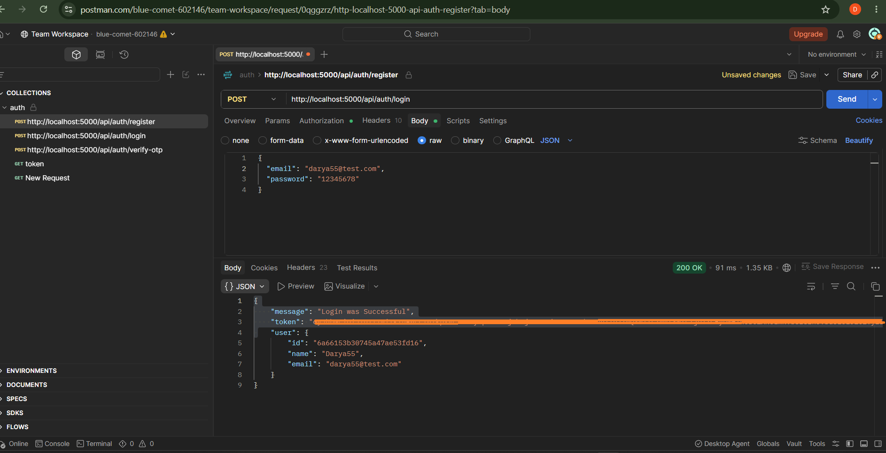

# Blog Management REST API


A production-ready Blog Management API built with Node.js, Express, MongoDB, JWT authentication, Swagger, testing, and scalable backend architecture.

---
## Overview

Blog Management API is a production-ready backend application designed to manage users, posts, and content through a secure and scalable RESTful API.

The project provides a complete backend solution for creating, managing, and organizing blog content with secure authentication, role-based access control, data validation, and efficient API architecture.

The application follows professional backend development practices including separation of concerns, repository pattern, service layer architecture, centralized error handling, API documentation, and automated testing.

This project demonstrates the implementation of a real-world content management system using modern backend technologies and scalable development principles.

# Features

## Authentication & Authorization
- User registration and authentication
- Secure password hashing
- JWT-based authentication
- Create, update, and delete blog posts
- User-based post ownership
- Search functionality
- Pagination and sorting
- Request validation
- Centralized error handling
- RESTful API design
- Swagger API documentation
- Automated API testing

## Posts Management
- Create post
- Get all posts
- Search posts
- Pagination
- Sorting (newest / oldest)
- Update post
- Delete post
- Owner permission checking

## Comments System
- Create comments
- Get comments by post
- Update comments
- Delete comments
- Comment ownership validation

## Validation & Error Handling
- Request validation using Joi
- Centralized error handling middleware
- Custom AppError class
- Proper HTTP status codes

## Security
- Helmet security headers
- Express Rate Limit
- Mongo Sanitize
- Password hashing with bcrypt

## Logging
- HTTP request logging with Morgan
- Application logging with Winston

## Documentation & Testing
- Swagger API Documentation
- Integration testing with Jest
- API testing with Supertest
- Authentication tests
- Authorization tests
- Edge case testing

---

# Tech Stack

## Backend

- Node.js
- Express.js
- MongoDB
- Mongoose

## Authentication

- JWT
- bcrypt

## Authentication Flow

The authentication system is implemented using JWT-based authentication.

Authentication flow:

User
|
↓
Register / Login Request
|
↓
Auth Controller
|
↓
Auth Service
|
↓
Password hashing with bcrypt
|
↓
JWT token generation
|
↓
Client receives access token
|
↓
Protected API requests send JWT token
|
↓
Authentication Middleware verifies token
|
↓
Controller accesses authenticated user data


### Login Process

1. User sends email and password.
2. Server verifies user credentials.
3. Password is compared using bcrypt.
4. A JWT token is generated.
5. The token is returned to the client.

### Protected Routes

Protected endpoints require a valid JWT token:
Authorization: Bearer <token>

The authentication middleware validates the token before allowing access to protected resources.

## Validation

- Joi

## Testing

- Jest
- Supertest

## Documentation

- Swagger (OpenAPI)

## Development Tools

- Git
- GitHub
- Postman

---

# Project Structure

```
server
│
├── src
│   │
│   ├── config
│   │   ├── db.js
│   │   ├── env.js
│   │   ├── logger.js
│   │   └── swagger.js
│   │
│   ├── controllers
│   │
│   ├── middleware
│   │
│   ├── models
│   │
│   ├── routes
│   │
│   ├── validations
│   │
│   ├── utils
│
├── tests
│
├── app.js
├── server.js
├── package.json
└── .env.example
```

---
## Database Schema

The project uses MongoDB with Mongoose ODM for database modeling.

The main collections are:

---

## User Collection

Stores registered user information.

```
User
 |
 ├── _id
 ├── name
 ├── email
 ├── password
 ├── createdAt
 └── updatedAt
```

### User Model

| Field | Type | Description |
|---|---|---|
| `_id` | ObjectId | Unique identifier |
| `name` | String | User full name |
| `email` | String | Unique user email |
| `password` | String | Hashed password |
| `createdAt` | Date | Account creation date |
| `updatedAt` | Date | Last update date |

---

## Post Collection

Stores blog posts created by users.

```
Post
 |
 ├── _id
 ├── title
 ├── content
 ├── author
 ├── createdAt
 └── updatedAt
```

### Post Model

| Field | Type | Description |
|---|---|---|
| `_id` | ObjectId | Unique identifier |
| `title` | String | Post title |
| `content` | String | Post content |
| `author` | ObjectId | Reference to User collection |
| `createdAt` | Date | Post creation date |
| `updatedAt` | Date | Last update date |

---

## Database Relationship

```
User
 |
 | 1 : Many
 |
 ↓

Posts
```

A single user can create multiple posts.

The relationship is implemented using MongoDB ObjectId references with Mongoose.

Comment
 |
 ├── _id
 ├── content
 ├── user
 ├── post
 ├── createdAt
 └── updatedAt

 User
 |
 | 1 : Many
 ↓
Posts
 |
 | 1 : Many
 ↓
Comments

 ---
# Installation

## Clone Repository

```bash
git clone https://github.com/DaryaMarco/gym-management-system.git
```

## Go to Project Directory

```bash
cd gym-management-system/server
```

## Install Dependencies

```bash
npm install
```

---

# Environment Variables

Create a `.env` file in the server directory.

Example:

```env
PORT=5000

MONGO_URI=mongodb://127.0.0.1:27017/gym

JWT_SECRET=your_secret_key

NODE_ENV=development
```

You can check `.env.example` for required variables.

---

# Running The Project

## Development Mode

```bash
npm run dev
```

## Production Mode

```bash
npm start
```

---

# Running Tests

Run all tests:

```bash
npm test
```

Test coverage includes:

- Authentication flow
- Protected routes
- CRUD operations
- Validation errors
- Invalid IDs
- Permission checks
- Edge cases

---

# API Documentation

Swagger documentation is available at:

```text
https://gym-management-system-htx3.onrender.com/api-docs
```

## Live Demo

API:

https://gym-management-system-htx3.onrender.com

Swagger:

https://gym-management-system-htx3.onrender.com/api-docs

---

## Screenshots

### Swagger Documentation


---

### Live API on Render


---

### Postman API Testing



---

# API Endpoints

## Authentication

Register:

```
POST /api/auth/register
```

Login:

```
POST /api/auth/login
```

---

# Posts

Get Posts:

```
GET /api/posts
```

Create Post:

```
POST /api/posts
```

Update Post:

```
PUT /api/posts/:id
```

Delete Post:

```
DELETE /api/posts/:id
```

---

# Comments

Create Comment:

```
POST /api/posts/:postId/comments
```

Get Comments:

```
GET /api/posts/:postId/comments
```

Update Comment:

```
PUT /api/posts/:postId/comments/:commentId
```

Delete Comment:

```
DELETE /api/posts/:postId/comments/:commentId
```

---

# Error Handling

The API uses centralized error handling with:

- Custom error classes
- Middleware based error processing
- Structured error responses
- Winston logging

---

# Testing Strategy

Tests are written using:

- Jest
- Supertest

Implemented scenarios:

- Successful requests
- Unauthorized requests
- Forbidden access
- Invalid ObjectId handling
- Validation failures
- Resource not found cases

---

# Security Practices

Implemented security measures:

- JWT authentication
- Password hashing
- Request validation
- Rate limiting
- Secure HTTP headers
- MongoDB injection protection

---

# Future Improvements

Possible future enhancements:

- CI/CD pipeline
- AWS deployment
- User profile management
- File upload system
- Frontend application with React

---

# License

This project is created for learning purposes and portfolio demonstration.